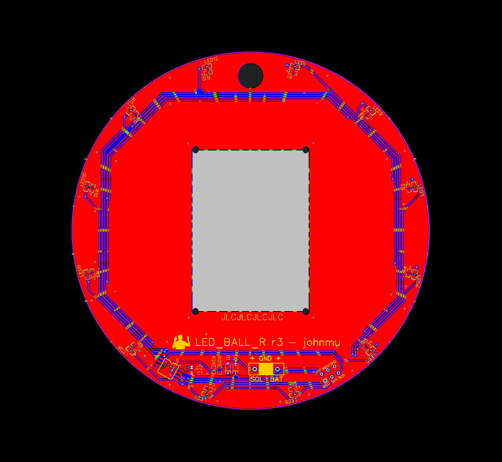

# PCB made in EasyEDA

[MIT license](LICENSE) / (c) 2023 [John Mueller](https://johnmu.com/)

Note that these are more for reference rather than for reproduction :-).
I'm not super-happy with the hardware because of its size & lack of weatherability.

## Schematic (PDF)

* [schematic](Schematic_led_ball_03_2023-02-26.pdf)

## PCB layout

* [zip files](PCB_PCB_led_ball_R_03_2023-02-26.zip)
* [EASYEDA json export](PCB_PCB_led_ball_R_03_2023-02-26.json)

## Parts

[BOM](BOM_PCB_led_ball_R_03_2023-02-26.csv)

All LEDs, resistors, capacitors in 0603 size. Annoying to hand-solder, but doable.
